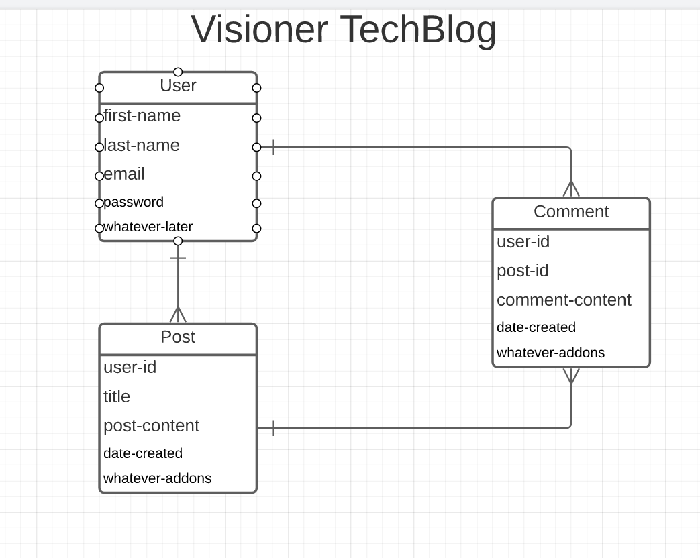

# Visioner - Tech Blog (MVC)

## Table of contents
- [Description](#Description)
- [User Story](#User/Story)
- [Usage](#Usage)
- [Framework HTML/JS](#Framework)
- [Credits](#Credits)
- [Contributors](#Contributing)
- [Features](#Features)

## Illustration




## Description

A CMS-style blog site where developers can publish their posts and comment on other developers’ posts as well. The app it's following the MVC paradigm in its architectural structure, using Handlebars.js as the templating language, Sequelize as the ORM, and the express-session npm package for authentication.
   
## User/Story  
```md
AS A developer who writes about tech
I WANT a CMS-style blog site
SO THAT I can publish articles, blog posts, and my thoughts and opinions
```

## Usage

* Visit [visioner-techblog](https://visioner-techblog.herokuapp.com)

* Base options
  * View posts as a visitor

  * Sign-up in order to be able to create posts

  * Once logged-In able to view and comment posts...

## Framework

#### JavaScript(back-end) and public Html/CSS

  * MVC paradigm
    * Handlebars.js as the templating language

    * Sequelize as the ORM

    * express-session npm package for authentication.

    * cloduinary npm package for Uploading img...

    
## Credits
 * - [StackOverFlow](https://stackoverflow.com/)
  * - [Bootstrap](https://getbootstrap.com/docs/4.6/getting-started/introduction/)
  * - [W3Schools](https://www.w3schools.com/sql/)
 * - [Cloudinary](https://cloudinary.com/documentation)


## Directory
* [GitHub Source](https://github.com/VictorCodrean/Visioner_TechBlog)

## Contributing
Victor Codrean    
*  [Visioner/app link:](https://visioner-techblog.herokuapp.com/)

## Features
* Targets

  * For now you'are able to add new Posts/Comments and delete them...(Targetting the possibility of the UPDATE route in order to be able to edit existing comments/posts).

  * Add likes opportunity

  * Reply to a specific comment would be really nice

  * Count Views of each post and then render in order by view count... 


Asking me any questions:

<a href="mailto:codreanvictor@gmail.com" style="text-decoration:none"></a>

[](https://github.com/VictorCodrean)
